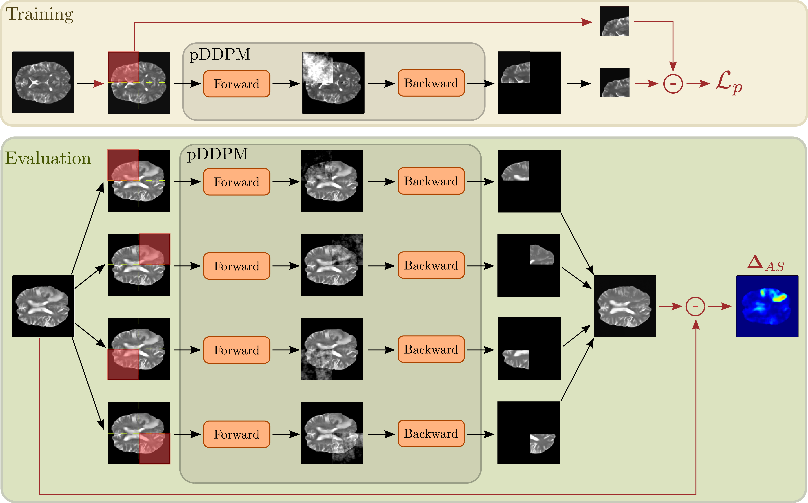

# patched-Diffusion-Models-UAD
Codebase for the paper [Patched Diffusion Models for Unsupervised Anomaly Detection](https://arxiv.org/abs/2303.03758) accepted at MIDL23.

## Graphical abstract

## Data
We use the IXI data set, the BraTS21 data set and the MSLUB data set for our experiments. 
You can download/request the data sets here:

* IXI: https://brain-development.org/ixi-dataset/
* BraTS21: http://braintumorsegmentation.org/
* MSLUB: http://lit.fe.uni-lj.si/tools.php?lang=eng

After downloading, place the data in your DATA_DIR.
The directory structure should look like this: 

    DATA_DIR
    ├── Train
    │   ├── ixi
    │   │   ├── mask
    │   │   ├── t2
    ├── Test
    │   ├── Brats21
    │   │   ├── mask
    │   │   ├── t2
    │   │   ├── seg
    │   ├── MSLUB
    │   │   ├── mask
    │   │   ├── t2
    │   │   ├── seg
    ├── splits
    │   ├──  Brats21_test.csv        
    │   ├──  Brats21_val.csv   
        ├──  MSLUB_val.csv 
        ├──  MSLUB_test.csv
        ├──  IXI_train_fold0.csv
        ├──  IXI_train_fold1.csv 
    │   └── ...                
    └── ...

You should then specify the location of DATA_DIR in the pc_environment.env file. Additionally, specify the LOG_DIR, where runs will be saved. 

## Environment Set-up
To download the code type 

    git clone git@github.com:FinnBehrendt/patched-Diffusion-Models-UAD.git

In your linux terminal and switch directories via

    cd patched-Diffusion-Models-UAD

To setup the environment with all required packages and libraries, you need to install anaconda first. 

Then, run 

    conda env create -f environment.yml -n pddpm-uad

and subsequently run 

    conda activate pddpm-uad
    pip install -r requirements.txt

to install all required packages.

## Run Experiments

To run the training and evaluation of the pDDPM, simply execute 

    python run.py experiment=MIDL23_DDPM/DDPM_patched

in your terminal. 

Note that you will need an NVIDIA GPU with sufficient memory (~20GB) to run the experiment. 

